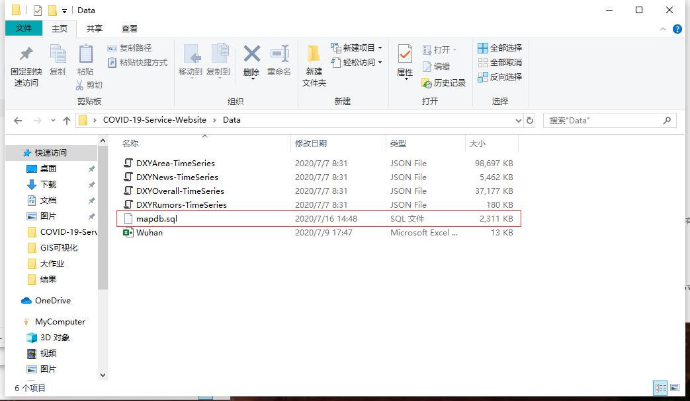
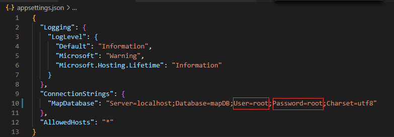

# COVID-19-Service-Website

         

## 系统环境

- Windows 7或更高版本
- VS Code 1.47
- .Net Core 3.1
- Apache ECharts 4.8
- axios 0.19

## 使用帮助

1. 克隆该项目至本地；
2. 新建 MySQL 连接，并新建数据库 mapDB；
3. 将项目 Data 目录下的 mapdb.sql 文件导入至 mapDB 数据库；
4. 修改 appsetting.json 中的数据库连接字符串，填入新建连接时设置的用户名和密码；
5. 在 VSCode 中运行项目，自动跳转至主页。

## 说明

- 本项目为武汉大学第三学期《计算社会学与社会地理计算》课程大作业仓库，在《GIS可视化》课程上介绍的内容只是此项目的一部分功能，并由仓库拥有者本人（钟源）设计开发。
- 《GIS可视化》课程上介绍的部分已移至[新的仓库](https://github.com/ashyseer/COVIDView)。

## 更多文档与资源

- 数据来源：[DXY-COVID-19-Data](https://github.com/BlankerL/DXY-COVID-19-Data)
- [Apache ECharts官方文档](https://echarts.apache.org/zh/index.html)
- [axios API中文文档](http://www.axios-js.com/)
- [Web API说明](Web-API-Instruction.md)

